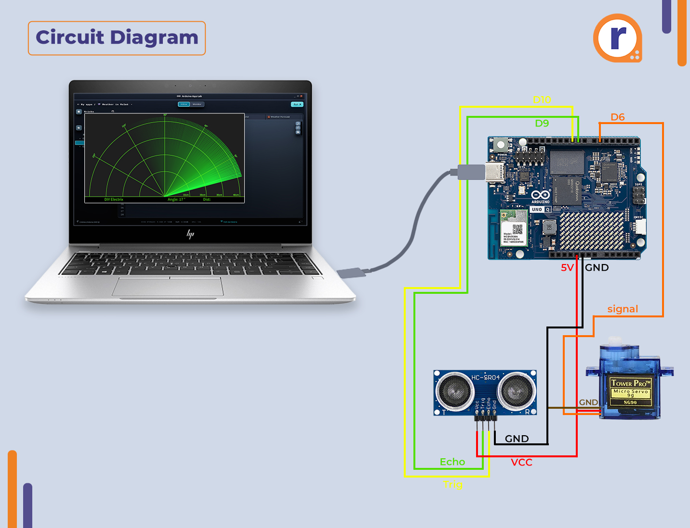

# robotic-radar

Arduino-based ultrasonic radar using HC-SR04, SG90 servo, and Python Web UI visualization.

---

## 📷 Preview

### Wiring Diagram

---

## 🧰 Components

- Arduino Nano / Uno
- HC-SR04 Ultrasonic Sensor
- SG90 Servo Motor
- Jumper wires
- Breadboard
- USB cable

---

## 🖥 Software Stack

- Arduino (C++)
- Python (pyserial, socketio)
- Web UI:
  - HTML
  - CSS
  - JavaScript (Canvas)
  - Socket.IO

---

## ⚡ Features

- Real-time radar scanning
- Servo sweep motion (30°–150°)
- Distance measurement using ultrasonic sensor
- Live visualization in browser
- Smooth radar animation

---

## 📁 Project Structure
